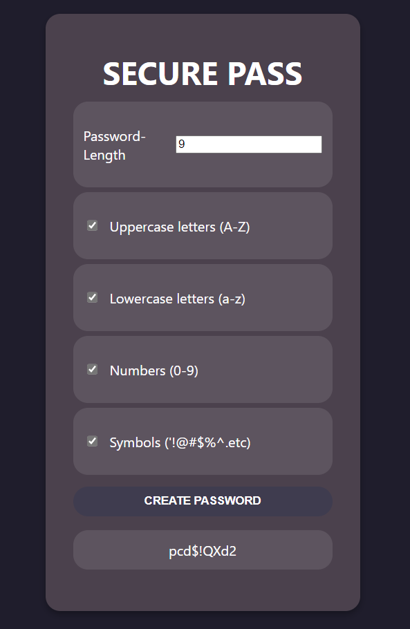
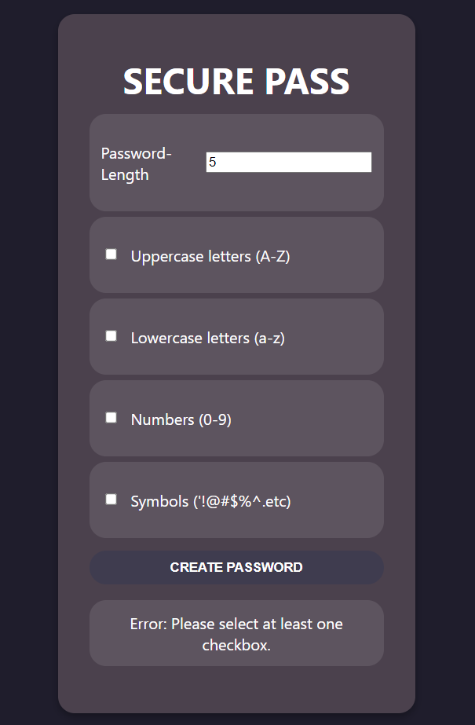

# React Password Generator

## A fully functional program which creates secure passwords with ease.

Crafted as an interactive web app, this password generator is created using React, combined with HTML and CSS, which provides an excellent experience for the user. 

### Features
* Flexible Password Length: Allows users to enter the password length that they need.
* Character Sets: Lets users decide if they want to include uppercase letters, lowercase letters, numbers and symbols in their generated password.
* Error Handling: Checks for various wrong inputs users may enter like a password length of 0 and below or not pressing any of the checkboxes.

### How to Use Project
* Open the web app
* Enter correct password length at the top
* Select all checkboxes that you need
* Create Password, your password will be shown below

